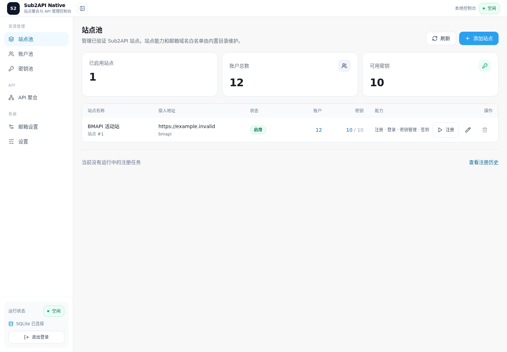
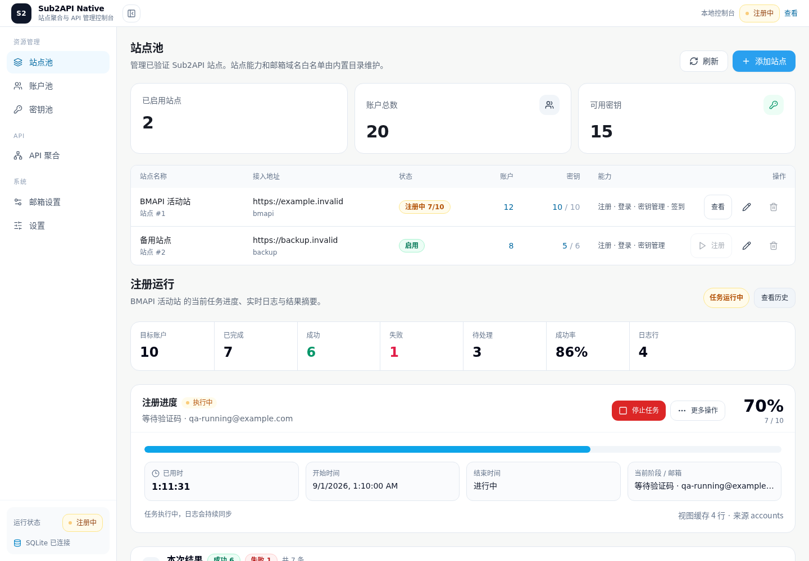
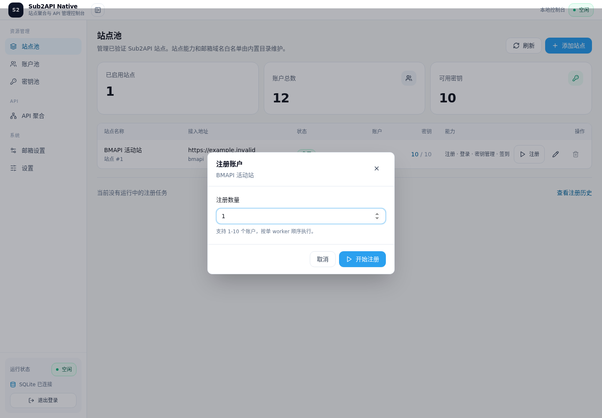
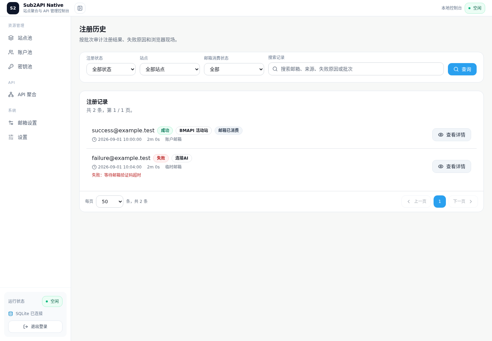

# Sub2API Native

Sub2API Native 是一个面向本地和局域网部署的 Sub2API 管理控制台。它把多个
已部署站点的账户、密钥和注册流程集中到一个界面，并提供统一的 Responses API
入口。邮箱能力由随项目固定版本部署的 OutlookEmail 提供。

## 适用场景

- 需要管理多个 Sub2API 站点及其账户、密钥的个人或小团队。
- 需要从站点池发起注册，并在同一页面查看进度、日志和结果。
- 需要把多个站点账户聚合成一个兼容 OpenAI Responses API 的内部服务。
- 需要在没有桌面环境的 Linux 主机上运行浏览器自动化和邮箱收码。
- 需要在局域网内通过原生 OutlookEmail 界面维护邮箱账户。

## 核心能力

- **站点池**：维护已验证的站点（Profile），从站点行发起注册。
- **账户池**：集中管理站点账户（Account），执行登录、验证和签到。
- **密钥池**：查看账户 API Key，选择参与聚合的密钥。
- **API 聚合**：由启用站点、活跃账户和选定密钥自动生成可调度集合。
- **邮箱设置**：查看 OutlookEmail 状态、配置取信规则，并一键打开原生账户管理。
- **浏览器自动化**：使用 Camoufox 与 Xvfb 执行注册、验证等需要浏览器的操作。

## 资源关系

~~~text
Profile（站点）
    -> Account（账户）
        -> ApiKey（密钥）
            -> Relay（API 聚合运行态）
~~~

注册和手工验证是账户接入方式；注册历史是审计数据，不是独立的资源池。

## 运行架构

项目采用一个仓库、一个本地镜像和一个容器：

~~~text
一个容器
├── Sub2API Native（FastAPI + React）  :8787
└── OutlookEmail（原生 Flask/Gunicorn） :5000 -> 宿主机 15000
~~~

OutlookEmail 保持 pinned Git submodule 和原生管理界面。两个应用使用独立的
Python 虚拟环境、独立 SQLite 数据库，只通过 HTTP API 交互；不需要 Nginx、
Supervisor 或数据库合并。

## 界面截图

<table>
  <tr>
    <td align="center">
      <strong>站点池</strong> 
      
    </td>
    <td align="center">
      <strong>注册运行</strong> 
      
    </td>
  </tr>
  <tr>
    <td align="center">
      <strong>注册弹窗</strong> 
      
    </td>
    <td align="center">
      <strong>注册历史</strong> 
      
    </td>
  </tr>
</table>

截图使用示例数据，仅用于展示界面结构。

## 快速使用

需要 Docker Engine、Docker Compose 和 Git。首次获取代码时初始化子模块：

~~~bash
git clone --recurse-submodules https://github.com/furedericca-lab/sub2api-native.git
cd sub2api-native/deploy
cp .env.example .env
cp outlookemail.env.example outlookemail.env
# 在 outlookemail.env 中设置本地 OutlookEmail 凭据
./check-mailbox-handoff.sh
docker compose -f compose.yaml build --pull=false
./check-mailbox-handoff.sh
docker compose -f docker-compose.yml up -d --no-build
~~~

打开 http://主机地址:8787 进入控制台。邮箱设置中的“邮箱账户管理”会打开
原生 OutlookEmail 界面，默认端口是 15000。需要局域网访问时，在 deploy/.env
中分别设置可监听的 OUTLOOKEMAIL_BIND_HOST 和浏览器可访问的
OUTLOOKEMAIL_PUBLIC_HOST；不要使用通配地址作为跳转目标。

通常的使用顺序是：在站点池添加或确认站点，在站点行发起注册；在账户池检查账户
并同步密钥；在密钥池选择聚合密钥；最后在 API 聚合页面启用 Relay 并使用客户端
凭据调用服务。

## 支持作者

已验证站点已内置作者的邀请 Aff，注册时会自动使用。如果这个项目帮到了您，欢迎
保留默认 Aff，就当请作者喝杯咖啡；您的每一次充值，都会为项目持续维护添一份动力。
您也可以选择清空默认 Aff。作者会默默放下咖啡杯，并含泪继续维护项目(ಥ﹏ಥ)

## API 服务

机器端点保持精简，只提供：

- GET /v1/models
- POST /v1/responses

## 许可证

此项目根据 Apache License 2.0 许可证授权 - 有关详细信息，请参阅 [LICENSE](LICENSE) 文件。

## 数据与升级

运行数据统一挂载在 data/，但 Sub2API 与 OutlookEmail 的 SQLite ownership
保持独立。OutlookEmail 的版本由 vendor/outlookEmail 的具体 commit 固定；升级
时更新该 commit 并重新本地构建。

开发、构建、部署、升级、迁移和恢复契约见 [AGENTS.md](AGENTS.md)。
